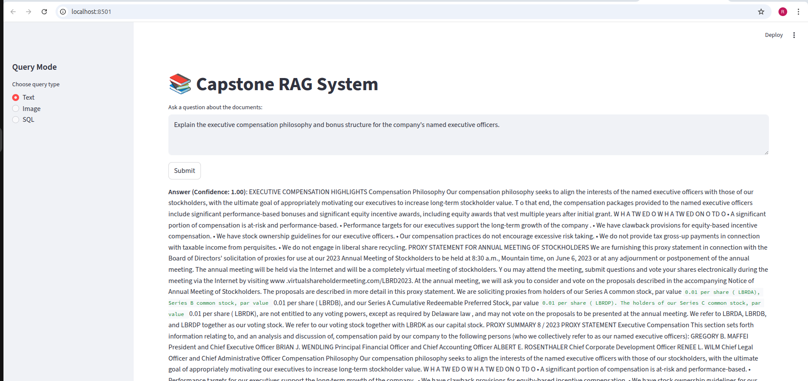
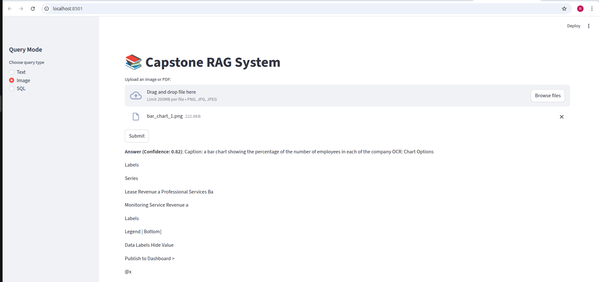
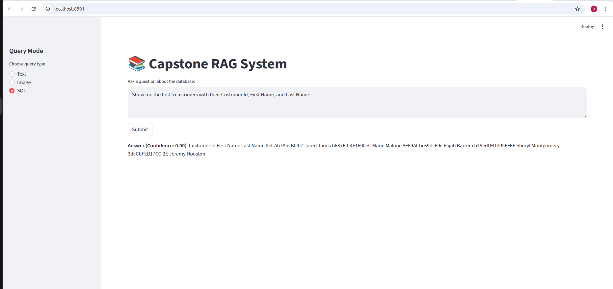

# DEPLOYMENT NOTES  
## DAY-5 Capstone – Multimodal RAG System

## Objective

This project delivers a unified **Multimodal Retrieval-Augmented Generation (RAG)** system supporting:

- Text-based document question answering  
- Image-based question answering (OCR + embeddings)  
- Natural language to SQL querying  
- Safe execution with validation  
- Confidence scoring and hallucination detection  
- Conversational memory support  

The system integrates retrieval, generation, validation, refinement, and logging into a single deployable interface.

---

## Integration of Previous Work

This deployment consolidates components developed across:

- **Day 1:** Text RAG (chunking, embeddings, retrieval)  
- **Day 2:** Improved retrieval strategies and context building  
- **Day 3:** Image RAG (OCR, CLIP embeddings, captioning)  
- **Day 4:** SQL QA engine (schema loading, SQL generation, validation, execution, summarization)  

All modules are integrated into a unified application.

---

## Core Enhancements (Day-5 Requirements)

- **Memory:** Stores last 5 user interactions per session for conversational continuity.  
- **Refinement Loop:** Re-evaluates generated answers using retrieved context and memory.  
- **Hallucination Detection:** Flags unsupported or uncertain responses.  
- **Confidence Score:** Provides reliability score for each output.  
- **SQL Safety:** Blocks unsafe operations (DROP, DELETE, INSERT, UPDATE, ALTER) and limits result size.  
- **Logging & Debugging:** Stores queries, responses, validation steps, and confidence scores in `CHAT-LOGS.json`.

---

## Core Project Files

### `/deployment/app.py`
Main application entry point.  
Handles `/ask`, `/ask-image`, and `/ask-sql` routes and integrates memory, evaluation, and logging.

### `/evaluation/rag_eval.py`
Implements refinement loop, hallucination detection, and confidence scoring.

### `/memory/memory_store.py`
Manages session-level memory (last 5 messages).

### `CHAT-LOGS.json`
Stores interaction history and metadata for debugging and evaluation.

---

## Output Modes

| Mode  | Output | Metadata |
|-------|--------|----------|
| Text  | Retrieved answer | Confidence score, hallucination flag |
| Image | OCR + embedding-based answer | Confidence score |
| SQL   | Executed results + NL summary | SQL query, confidence score |

---

---

## Screenshots

### Text Mode Output

### Image Mode Output

### SQL Mode Output

---

## Final Status

The system successfully integrates Text RAG, Image RAG, and SQL QA into a single deployed interface with memory, refinement, hallucination detection, secure execution, and logging. All DAY-5 capstone requirements are satisfied.