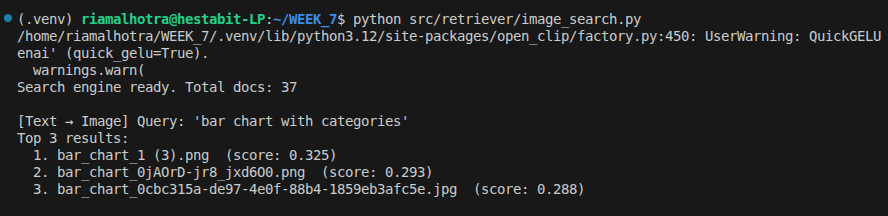
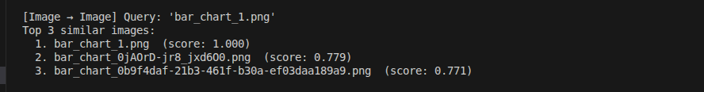
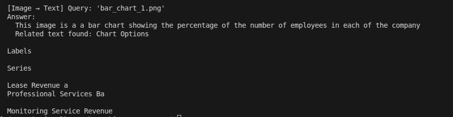

# DAY 3 — IMAGE RAG (MULTIMODAL RAG)

## Objective
Build a multimodal RAG system capable of handling images.

## Components Used
- CLIP (Image + Text Embeddings) — ViT-B-32
- Tesseract OCR (Text Extraction from images)
- BLIP (Image Captioning — Salesforce/blip-image-captioning-base)
- ChromaDB (Vector Database with cosine similarity)

## Dataset
- Source: Kaggle Graphs Dataset
- Classes: Bar Chart, Diagram, Flowchart, Graph, Growth Chart, Pie Chart
- Total images ingested: 37

## Pipeline Flow
1. Image loaded from directory (PNG/JPG)
2. System extracts:
   - OCR text (Tesseract)
   - Image caption (BLIP)
   - CLIP embedding (512-dim vector)
3. Embedding + metadata stored in ChromaDB

## Query Modes

### 1. Text → Image
User enters text → Convert to CLIP embedding → Search similar images
```
Query: "bar chart with categories"
```

**output**



### 2. Image → Image
User provides image → Generate CLIP embedding → Search similar images

```
Query: bar_chart_1.png
```
**output**




### 3. Image → Text Answer
Retrieve similar images → Return caption + OCR as text answer
```
Query: bar_chart_1.png
```
**output**




## Project Structure
```
WEEK_7/
├── src/
│   ├── embeddings/clip_embedder.py
│   ├── pipelines/image_ingest.py
│   └── retriever/image_search.py
├── data/raw/images/
└── vectorstore/
```

## Advantages
- Handles diagrams, scanned forms, charts
- Supports semantic image search
- Works for multimodal retrieval
- Persists vector index between sessions