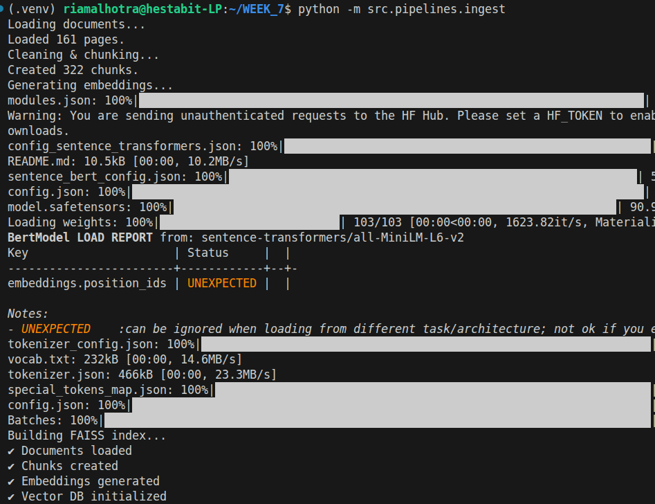
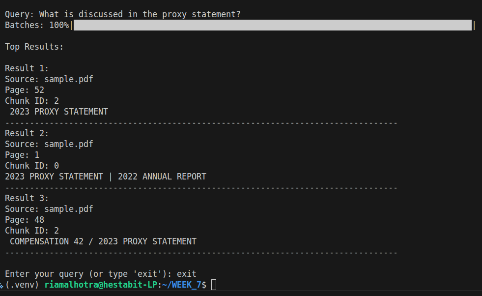

# RAG Architecture – Day 1 (Basic Semantic Retrieval)

## 1. Overview

This project implements a basic Retrieval-Augmented Generation (RAG) pipeline
using local embeddings and FAISS for vector search.

The system performs:

User Query → Embedding → Vector Search → Top-k Retrieval

This is a dense-vector semantic retrieval system without reranking or hybrid search.

---

## 2. System Architecture

### Step 1: Document Ingestion

- Input: PDF documents
- PDF is parsed into raw text
- Text is cleaned and normalized

Module:
src/ingestion/pipeline.py

---

### Step 2: Chunking

- Token-based chunking
- Chunk size: 600 tokens
- Overlap: (if implemented)
- Metadata stored:
  - source
  - page
  - chunk_id

Output:
src/data/chunks/chunks.json

---

### Step 3: Embedding Generation

- Model: sentence-transformers (MiniLM)
- Each chunk converted into dense vector representation
- Embeddings stored as NumPy array

Output:
src/data/embeddings/embeddings.npy

Module:
src/embeddings/embedder.py

---

### Step 4: Vector Store (FAISS)

- FAISS IndexFlatL2 used
- Embedding dimension determined by model
- Index stored locally

Output:
src/data/vectorstore/index.faiss

Module:
src/vectorstore/faiss_store.py

---

### Step 5: Query Retrieval

Query flow:

1. User query
2. Query embedding generated
3. FAISS similarity search (top_k)
4. Matching chunk metadata returned

Module:
src/retriever/query_engine.py

---

## 3. Retrieval Strategy

Current Retrieval Type:
- Dense semantic search
- Cosine/L2 similarity via FAISS
- Top-k ranking

No:
- Keyword search
- Reranking
- Metadata filtering
- Deduplication
- Context optimization

This is a basic retrieval baseline.

---

## 4. Strengths

✔ Fast semantic retrieval  
✔ Local embedding model  
✔ Local vector database  
✔ Modular architecture  
✔ Fully traceable metadata  

---

## 5. Limitations (To Be Improved in Day 2)

- Dense-only retrieval (no hybrid search)
- No BM25 keyword fallback
- No reranking (cross-encoder)
- No Max Marginal Relevance (MMR)
- No metadata filters
- No chunk deduplication
- No LLM answer generation
- No hallucination detection

---

## 6. Future Improvements (Roadmap)

Day 2:
- Hybrid Retrieval (BM25 + Dense)
- Reranker integration
- Context builder
- Precision improvements

Day 3:
- Image RAG (CLIP + OCR)

Day 4:
- SQL Question Answering

Day 5:
- Memory + Evaluation + API Deployment

---

---

## 7. Execution Proof

### Ingestion Pipeline Output

### Retrieval Output

## 8. Conclusion

Day-1 successfully implements a complete dense semantic retrieval pipeline using:

- Local embeddings
- FAISS vector indexing
- Modular retriever architecture

This forms the foundation for advanced RAG systems to be built in subsequent phases.
