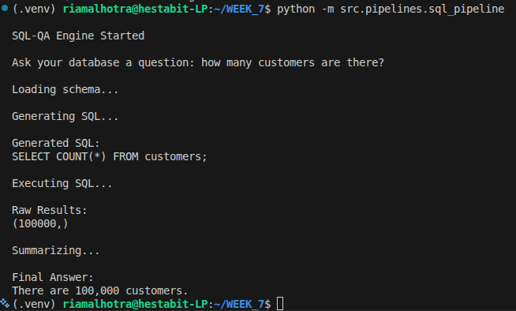

# SQL-QA Engine Documentation

## Objective
Build a natural language to SQL system that:
- Generates SQL from user questions
- Validates SQL
- Executes safely
- Summarizes results

---

## Architecture

User → SQL Generator (LLM) → Validator → SQLite Executor → Summarizer (LLM)

---

## Components

### 1. schema_loader.py
Automatically extracts database schema.

### 2. sql_generator.py
Generates SQL query using LLM.

### 3. sql_pipeline.py
Orchestrates:
- SQL validation
- Safe execution
- Result summarization

---

## Security Features
- Only SELECT queries allowed
- Forbidden keywords blocked
- Limited result fetch (100 rows max)

---

## Limitations
- Single-table queries
- No JOIN reasoning
- No query cost optimization

---
**output**
